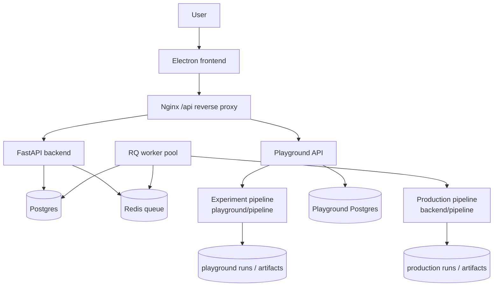
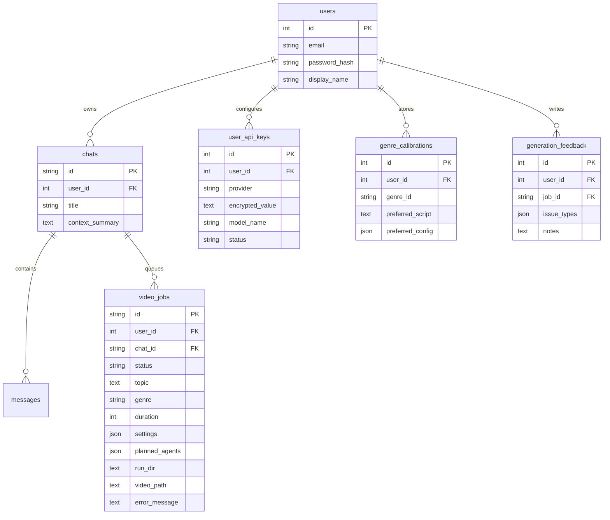

# Architecture

DesktopApp uses a production-style, database-backed, queue-driven architecture for generating YouTube Shorts. The design separates product state, orchestration, experimental pipeline work, production generation, user calibration, and rendering into independently recoverable services.

## Recommendation

Use the DesktopApp architecture as the production foundation:

- FastAPI backend for auth, chat, onboarding, API-key setup, jobs, and preview/download.
- Postgres as the durable source of truth for users, chats, jobs, calibration, feedback, and API-key metadata.
- Redis/RQ workers for asynchronous video generation.
- A master-agent route that locks constraints before work starts.
- A staged production pipeline with validation gates.
- A separate playground pipeline copy for experimental changes.
- Hybrid visuals: stock video b-roll first, image fallback second.
- Existing online LLM providers: OpenAI, Anthropic, Gemini, and Groq.

Keep the app on the provider system already present in this codebase. The current product supports managed LLM providers and per-user model/key selection. Narration uses Google TTS plus local Whisper alignment.

## Runtime Services



## Product Flow

```text
Login/signup
-> API setup
-> genre + creator intent
-> 3 calibration samples
-> user selects preferred style
-> continuous video chat
-> master extracts intent/settings
-> queue final or updated short
-> preview/download
-> save feedback
-> future generations use calibration + feedback memory
```

## Playground-First Pipeline Policy

Pipeline code has two copies by design:

- `DesktopApp/playground/pipeline` is the experiment surface.
- `DesktopApp/backend/pipeline` is the production surface used by the desktop backend and worker.

Future pipeline changes should start in `playground/pipeline`. After a playground run succeeds and the rendered output looks right, promote the specific change into `backend/pipeline`. This avoids accidental production regressions while still keeping the playground realistic: it runs the same style of agents, config, assets, audio, captions, and FFmpeg renderer as production.

## Generation Pipeline

```mermaid
flowchart LR
    Master[Master Agent] --> Script[Script Agent]
    Script --> ValidateScript[Script self-check + validation + repair]
    ValidateScript --> Assets[Asset Agent]
    Assets --> ValidateAssets[Asset validation]
    ValidateAssets --> Audio[Audio Agent]
    Audio --> ValidateAudio[Audio validation]
    ValidateAudio --> Captions[Caption Agent]
    Captions --> ValidateCaptions[Caption validation]
    ValidateCaptions --> Render[FFmpeg Render Agent]
    Render --> ValidateRender[Render validation]
    ValidateRender --> Final[1080x1920 MP4]
```



## Visual Method

The best production strategy is the hybrid method now implemented in the pipeline:

1. The script creates concrete visual cues.
2. The asset agent fetches image fallbacks for every cue.
3. The asset agent prefers Pexels stock video b-roll when available.
4. The renderer preserves cue order and uses video clips first.
5. If a clip is missing or unusable, the renderer falls back to the matching image.
6. FFmpeg normalizes every visual segment to constant FPS before `xfade`, preventing variable-frame-rate stock clips from breaking renders.

This keeps the pipeline reliable while producing more dynamic video than image-only rendering.

## LLM Provider Strategy

The app should use the provider system already present in the codebase:

- `openai`
- `anthropic`
- `gemini`
- `groq`
- `auto`

The master agent and script agent should use the provider selected by the user or environment. Users can save provider-specific keys in the app, and saved keys override `.env` values for that user.

## Audio And Captions

The current default is:

- Google Cloud TTS for clean narrator audio.
- Local Whisper for word-level alignment.
- SRT + ASS captions generated from real word timestamps.

AssemblyAI can be added later as an optional cloud alignment provider, but it is not required for this TTS-first workflow. Whisper is the better default because generated narration is clean, single-speaker audio.

## Data Model

The real current core data model is:



## Known Flaws To Keep Fixing

- Docs should describe this DesktopApp codebase only. Do not let old experiments, template text, or external project names drive new implementation work.
- Playground and production pipeline copies can drift. That is intentional while experimenting, but promoted changes should be small and deliberate.
- Docker images must be rebuilt after pipeline code changes because each service image copies its own pipeline source.
- There is no YouTube upload approval flow yet. Keep preview/download as the production-safe first milestone.
- The app should not expose or log raw API keys. If keys are pasted into chat or committed to files, rotate them.
- The current asset source is mostly Pexels for video b-roll. For higher visual quality, add provider diversity and stronger clip relevance scoring later.
